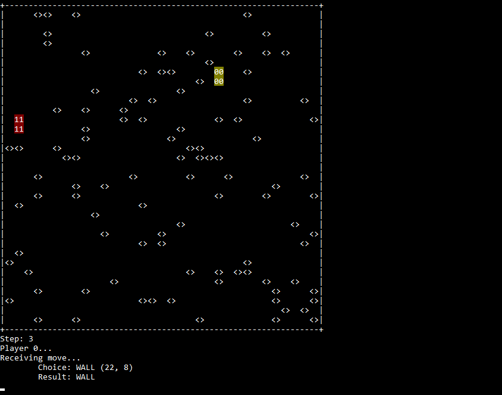
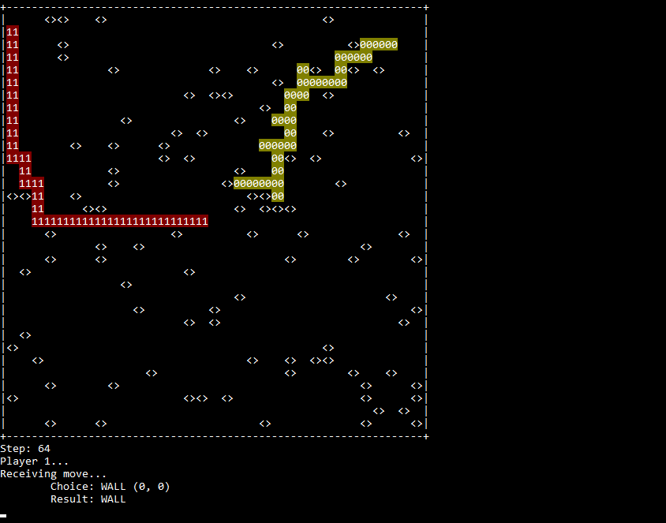
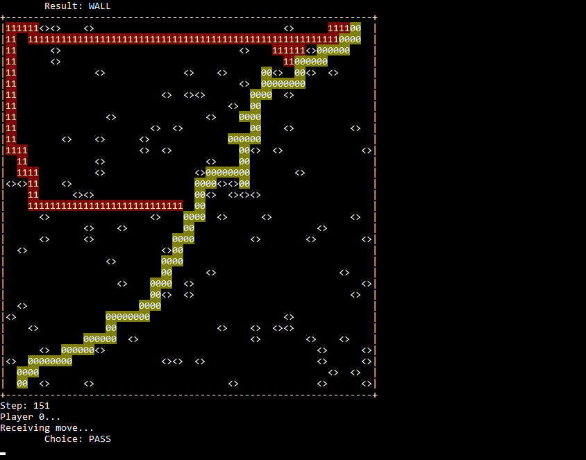

# Territory game

## Usage

## Example
The screencast provided below is output by a referee program. 
Player 0 is the current program. 
Player 1 is another program.
## 1 Start

## 2

## 3 Player 0 ends
